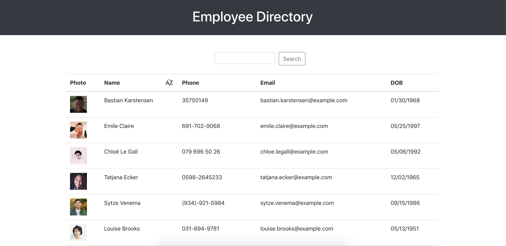
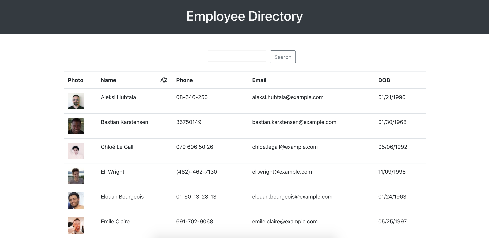

# Employee Directory
This application can be used to view basic employee information in an easy-to-read table format.

## User Story
As a user, I want to be able to view my entire employee directory at once so that I have quick access to their information.

## Features 
### Instant Search
As you type in the name of an employee in the search field, results are filtered as you type.

### Sort by Name
By clicking the sort icon next to the "Name" field in the table header, the user can sort their results alphabetically or reverse-alphabetically.

Initial results:

Results sorted by name alphabetically:

### Built With
- React
- Bootstrap
- RandomUser API
- Axios
- CSS

This project was bootstrapped with [Create React App](https://github.com/facebook/create-react-app).

